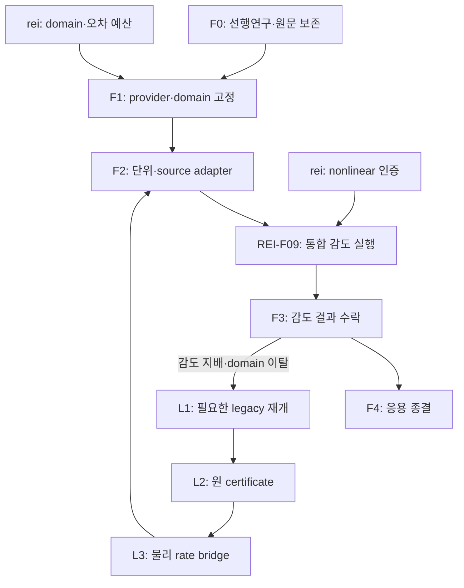

# WU088_HH: fastest / legacy 통합 연구·PR 계획

## 목적과 완료의 의미

첫 재이온화 이력의 원자 입력은 외부 rate로 닫고, 기존 Frozen107→D_col/D_row→epsilon→represented gap→Pareto 경로는 독립 확장 lane으로 보존한다. 외부 k(T)는 O/H/D/K 행렬의 대체품이 아니며 자체 행렬 인증은 물리 ionization rate의 증명이 아니다. 두 lane의 합류 지점은 process/domain/stoichiometry/heat/error를 명시한 동일 provider interface와 rei의 observable sensitivity다.

현재 latest HEAD 및 실물 백업은 REPO_SNAPSHOT.json과 legacy_sources/MANIFEST.json에 있다. C0/C1 기존 성과는 재사용하며 전체 suite 재실행을 계획의 선행조건으로 만들지 않는다. portable 선행연구는 PREWORK_KO.md와 34-check receipt까지 완료했다.

## bounded 작업 및 PR 단위

| 노드/PR | 입력 → 산출물 | 실제 수행처/의존성 | 종료 기준 |
|---|---|---|---|
| HH-F0 문서·원문 보존 | 현재 sources → 이 패키지/34 checks | 채팅 완료 | current commit·gate·source hashes 보존 |
| HH-F1 provider catalog | F0 + rei domain → process/provider JSON | Codex; rei R0 이후 | T 범위/모델 uncertainty/단위/ownership 고정; 범위 이탈 거절 |
| HH-F2 외부 rate adapter | F1 → Rust 또는 consumer가 선택한 동일 API adapter | Codex; 외부식 재사용 | CGS/SI·cutoff·no half·heat 중복·도함수 tests, metadata동반 |
| HH-F3 감도 결과 해석·수락 | F2 + REI-F09 결과 → HH_SENSITIVITY_ACCEPTANCE.json | HH Codex; 추가 history 실행 없음 | 동일 provider·model/numerical error 및 claim 안정성 확인 |
| HH-F4 조건부 종결 | F3 → APPLICATION_CLOSEOUT.json | 양쪽 동일 receipt참조 | 선택 claim범위 명시, legacy 자동삭제 없음 |
| HH-L1 FD2 독립검토 | immutable FD2 raw/RETURN → 넓은 interval 원인·다음 finite proposal | 필요 시 legacy 호출 | 이미소모 callback 재실행없음; cell입증없음을유지 |
| HH-L2 continuous 인증 | C1 + source-bound C2 join + 필요 cell batches → epsilon | legacy, fastest의존성 아님 | 전체원coverage·2592primitives·원예산을충족한경우만 |
| HH-L3 물리 observable bridge | L2 + relevantchannel → σ(E)/k(T) | consumer감도또는새observable이요구할때 | spin/frame/flux/asymptotic/continuum/error 별도검증 |

PR은 논리 작업단위다. 새 branch/PR을 자동 생성하지 않는다. 현재 연구 branch의 open PR #33에 additive documentation commit을 게시하고, 향후 각 implementation change는 같은 branch에서 범위별 commit/리뷰로 진행한다. 큰 옛 science diff를 이 문서 변경만으로 merge하지 않는다. 제목 예: `HH-F1: pin external ionization providers and consumer domain`; `HH-F2: add piecewise external-rate adapter with energy ownership`; `HH-F4: close selected reionization consumer and preserve legacy lane`.

## DAG

## 합류와 재개 계약

consumer가 process_id를 한 번만 소유하게 한다. 외부 baseline과 후일 자체 provider가 같은 reaction을 동시에 더하면 실패다. 새 provider를 admit한 뒤 같은 paired fixture/energy ledger를 통과시켜 versioned replace한다. 이전 provider·수치결과·실패값을 보존한다. 외부 fit 교체는 original HH primitive contract 변경의 권한이 아니다.

legacy 호출 조건은 (a) rate model 선택이 논문의 선택 claim을 바꿈, (b) 출처 support 밖 온도·에너지/상태가 필요, (c) 21cm spin/다유체 drift/상태분해·coherence가 핵심 observable, (d) 자체 scattering 이론 자체가 명시적 연구목표가 됨이다. 단순 '더 정밀할 수 있음'은 자동재개의 사유가 아니다.

## 비용 제한

low-cost worker는 TASKS.json에서 ready node 하나만 읽고 inputs의 지정파일만 연다. 출처 전체 재검색·모든 branch 조사·원자전체 suite·이미소모FD2 재실행은 하지 않는다. unforeseen physical decision/domain 변경은 정확한 missing field를 반환하고 실제화되지 않은 부분만 blocked로 둔다. 신규 대형 cell 실행은 원래의 별도 scope·host·one-shot 계약을 읽고 충족한 후에만 실행한다.

통합 paired-sensitivity campaign의 단일 실행 owner는 REI-F09다. HH-F3는 `docs/atomic_reionization_handoff_20261004_v1/runtime_outputs/paired_atomic_sensitivity_v1.json`을 읽어 해석·수락하며 별도 history나 중복 campaign을 실행하지 않는다.
